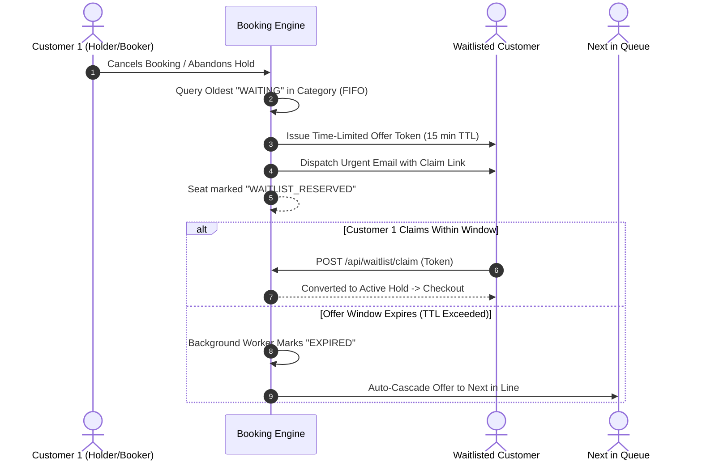

# System Design: High-Demand Ticket Booking & Allocation Engine

## 1. Executive Summary & Architecture
The TicketVault architecture is engineered for high-concurrency ticket sales (movies, concerts, galas) where instant sell-outs, seat holding race conditions, checkout abandonment, and cancellation waste are critical challenges. The system is architected as an event-driven, decoupled client-server application utilizing **Node.js/TypeScript**, **Prisma ORM**, **Socket.IO (WebSocket Hub)**, and **React Vite**.

```
[ Customer / Admin / Organiser ]
              │ (HTTP / WebSocket)
      ┌───────▼────────┐
      │   Express API  │ ◄───► [ Socket.IO Hub ] ──► (Real-Time Visual Grid)
      └───────┬────────┘
              │
    ┌─────────┴─────────┐
    │                   │
┌───▼───────────┐   ┌───▼──────────────┐   ┌───────────────────────┐
│ Atomic CAS    │   │ Waitlist Queue   │   │ Continuous TTL Expiry │
│ Engine (CAS)  │   │ Manager (FIFO)   │   │ Engine (Worker Loop)  │
└───┬───────────┘   └───┬──────────────┘   └───┬───────────────────┘
    │                   │                      │
    └───────────────────┼──────────────────────┘
                        │
             ┌──────────▼──────────┐
             │ SQLite / PostgreSQL │
             │ Database (ACID)     │
             └─────────────────────┘
```

---

## 2. Seat Hold & TTL Auto-Release Mechanism
When a customer selects seats on the interactive map, an atomic hold request is dispatched (`POST /api/seats/hold`):
1. **TTL Calculation**: Each event defines a configurable `holdTtlMinutes` (default: 10 minutes). An expiry timestamp `expiresAt = NOW() + TTL` and a cryptographically secure `holdToken` (256-bit hex) are issued.
2. **Real-Time Client Countdown**: The frontend displays a synchronized countdown timer with visual urgency alerts when $< 120$ seconds remain.
3. **Background Expiry Worker**: A background worker runs continuously every 3,000ms:
   - Queries `SeatHold` records where `expiresAt <= NOW()` and `isExpired == false`.
   - Batch-updates expired holds to `isExpired = true`.
   - For every held seat, triggers the **Waitlist Reallocation Pipeline** to offer it to queued customers before falling back to public `AVAILABLE` status.
   - Emits `seat_status_changed` WebSocket events to update all connected seat maps in sub-50ms.

---

## 3. Concurrency Protection & Race Condition Prevention
In flash-sale scenarios (e.g. Taylor Swift, IMAX releases), thousands of users attempt to hold the same seat simultaneously. 

### Compare-And-Swap (CAS) Atomic Locking
Rather than relying on application-level locks or pessimistic table locks that degrade throughput, the system executes an atomic Database Compare-And-Swap (CAS) query:

```sql
UPDATE "Seat"
SET "status" = 'HELD', "version" = "version" + 1
WHERE "id" IN (:seatIds)
  AND "eventId" = :eventId
  AND "status" = 'AVAILABLE';
```

- **Atomic Result Evaluation**:
  - The database engine guarantees single-statement row atomicity.
  - If `affected_rows == requested_seat_count`, the user wins the lock, and `SeatHold` records are persisted.
  - If `affected_rows < requested_seat_count`, another concurrent request locked one or more of the seats a fraction of a millisecond earlier.
  - The CAS update and the `SeatHold` inserts run in one database transaction. A short count throws, which rolls back only *this* request's partial CAS (seats legitimately held by other customers are never touched), and HTTP `409 Conflict` is returned.
- **Stress-Tested Correctness**: Verified via automated concurrency tests dispatching 10 parallel requests for the same seat: **exactly 1 winner succeeds, 9 are cleanly rejected, 0 double-bookings**.

---

## 4. Waitlist Auto-Assignment & Time-Limited Offer Flow
When an event tier is sold out, customers join a category-specific FIFO waitlist queue (`WaitlistEntry` with positional sequence):



1. **Trigger Points**: Waitlist reallocation automatically activates upon:
   - User booking cancellation (`POST /api/bookings/:id/cancel`).
   - Seat hold expiration / checkout abandonment.
2. **Offer Dispatch**:
   - The system retrieves `SELECT * FROM WaitlistEntry WHERE eventId = :id AND category = :cat AND status = 'WAITING' ORDER BY createdAt ASC LIMIT 1`.
   - Generates a unique `offerToken` with `offerExpiresAt = NOW() + 15 mins`.
   - Seat status transitions to `WAITLIST_RESERVED`.
   - A priority notification email is delivered via `EmailService` containing the direct redemption link (`/waitlist/claim/:token`).
3. **Offer Claim & Cascade**:
   - If the user clicks the claim link before expiration, the seat transitions into an active `HELD` session, directing them to the checkout portal.
   - If unclaimed upon `offerExpiresAt`, the background worker marks the entry `EXPIRED` and immediately cascades the offer to the **next waiting customer**.
   - If the waitlist queue is exhausted, the seat is released back to general `AVAILABLE` status.

---

## 5. QR Code Generation & Entry Verification
Upon confirmed checkout:
- Issues a signed **VaultPass** token, `TV1.<base64url(claims)>.<HMAC-SHA256>`, with claims `{ ref, eid, seats, iat, n }` (`n` = per-issue nonce). The token is stored as `Booking.qrCodeData` and rendered as the QR.
- Embeds the QR into confirmation emails and the digital pass.
- The scanner endpoint (`POST /api/admin/verify-ticket`) admits a pass only if:
  1. the HMAC verifies (constant-time compare), otherwise `FORGED`;
  2. the token equals the booking's *current* `qrCodeData`, otherwise `REVOKED` (superseded by a transfer);
  3. a CAS `UPDATE … SET checkInStatus='CHECKED_IN' WHERE checkInStatus='PENDING'` affects 1 row, otherwise `ALREADY_CHECKED_IN`. Simultaneous scans at different gates can't both admit.
- A typed booking reference is accepted as a staff-assisted `MANUAL_REFERENCE` check-in.

### Ticket Transfer
`POST /api/bookings/:id/transfer` re-signs a fresh VaultPass for the recipient and swaps ownership with a CAS update conditioned on `{ userId, status: CONFIRMED, checkInStatus: PENDING, qrCodeData: <old> }`. The sender's QR is revoked by construction, and a transfer can't race a check-in, a cancellation or a second transfer.

---

## 6. Smart Seat Finder
`GET /api/seats/event/:eventId/best?count=N&category=…` enumerates every window of N adjacent `AVAILABLE` seats in the same aisle block (`layoutConfig.rows[].aisleAfter`) and scores it:

`score = 100 − 55·|groupCentre − rowCentre| / halfRow − 45·|rowDepth − idealDepth| / maxGap`

`idealDepth` is about 0.6 for `MOVIE` (cinema sightline sweet spot) and 0 for `CONCERT` (front of stage). Up to 5 non-overlapping windows are returned. If no adjacent block exists, the best individual seats are returned with `contiguous: false`.
